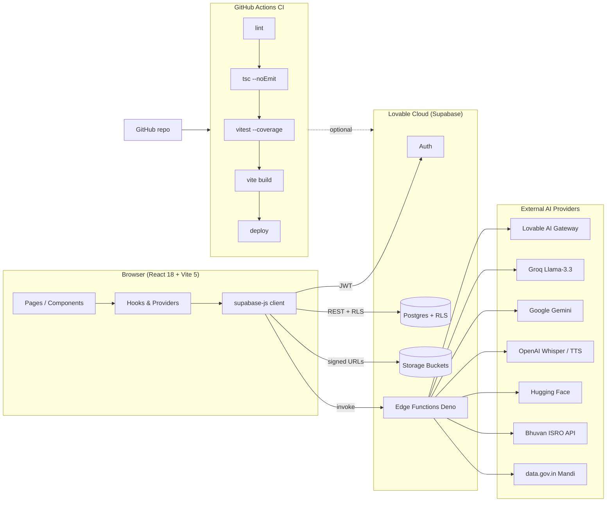

# Architecture

KisaanCompanion is a single-page React app that talks to a Supabase-managed
backend (Auth, Postgres, Storage, Edge Functions) and several third-party AI
providers.

## Request lifecycle

1. User opens a route. `AuthProvider` subscribes once to `supabase.auth.onAuthStateChange`.
2. `ActiveProfileProvider` loads the active `farmer_profiles` row.
3. Components call `supabase.from(...)` (RLS-scoped) or `supabase.functions.invoke(...)`.
4. Edge functions validate the bearer JWT via `_shared/auth.ts → requireUser`, then
   call the relevant AI provider with a secret from `Deno.env`.
5. Responses stream back (`text/event-stream` for chat) or return JSON.

## Key conventions

- **Auth singleton.** Only `useAuth` may subscribe to `onAuthStateChange`. All
  other consumers read from the provider.
- **Roles in a separate table.** `user_roles` + `has_role()` security-definer
  function — never read roles from `profiles`.
- **No service-role key in the browser.** All privileged work happens in edge
  functions.
- **Tokens for edge calls.** `lib/edgeAuth.ts → edgeToken()` returns the user
  JWT, falling back to the publishable anon key.
